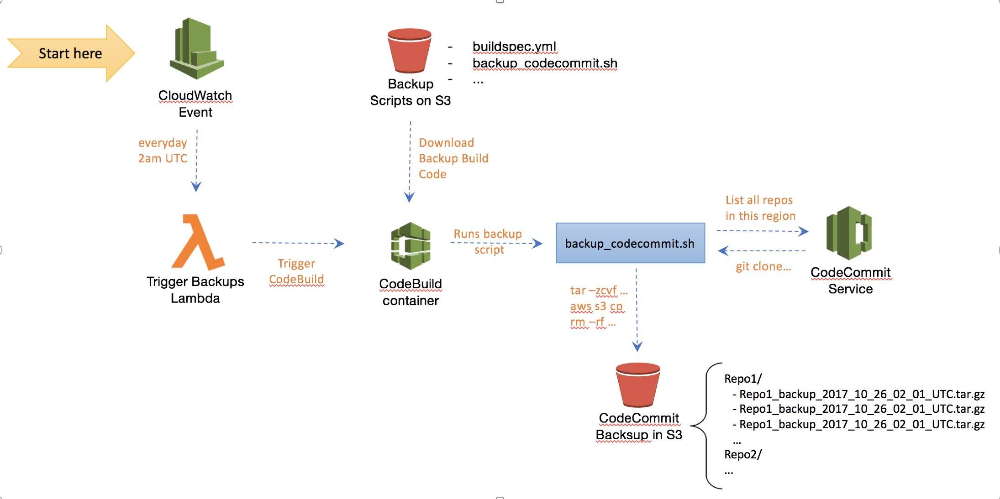

# Solution

This solution uses a Amazon CloudWatch event rule and AWS Lambda function to trigger an AWS CodeBuild build on a regular basis to back up all AWS CodeCommit repositories within a particular AWS account and region. See the figure below.

# Instructions

* Make sure the latest version of the [AWS Command Line Interface](http://docs.aws.amazon.com/cli/latest/userguide/installing.html) is installed (https://aws.amazon.com/cli/)
* Open script deploy.sh and update these parameters as desired: AWS profile, S3 buckets, and backup schedule 
* Important: CodeBuild requires the S3 bucket containing the backup scripts to reside within the same region as the CodeBuild build project
* The AWS profile must have permissions to create IAM roles, CodeBuild project and Lambda functions at a minimum
* By default, all CodeCommit repositories within the AWS region where the solution was deployed to will be backed up everyday at 2am (cron(0 2 * * ? *)) into the S3 bucket specified
* Run script ./deploy.sh to deploy the solution
* It should work out of the box without human intervention

Please check README.pptx for a diagrammatic view of the solution.

